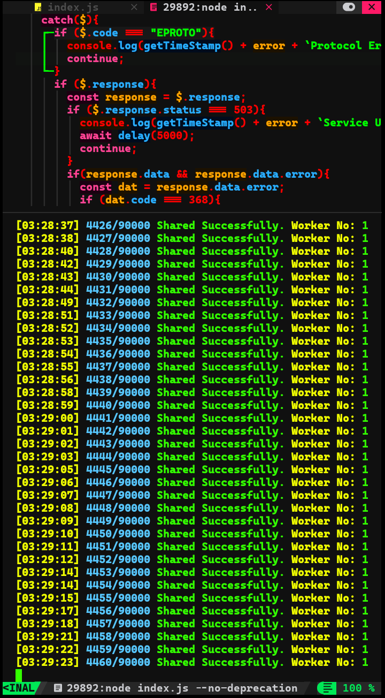
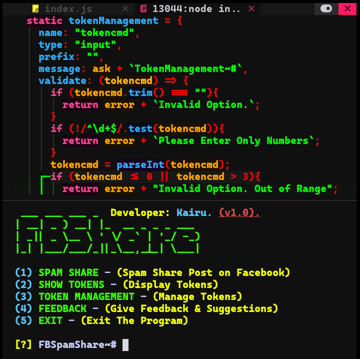

## Facebook Spam Share

**FSpamShare is a Node.js script that automates the process of sharing Facebook posts using multiple Facebook access tokens.**

## Installation
```bash
pkg update -y &&
pkg install git -y &&
git clone https://github.com/Kairu-bit/FSpamShare.git &&
cd FSpamShare
chmod +x setup.sh
./setup.sh
```

## Usage
```bash
FSS
```

## Security Warning 

> [!WARNING]
> **Do not use your personal Facebook account to avoid potential suspension. Use a new account for this purpose. The author is not responsible for any account suspensions.**

## ScreenShots





## Known Issues

- **Facebook imposes rate limits on API requests. Exceeding these limits may result in temporary blocks.**

## Contact
**For feedback or questions, you can reach out on**

- **Facebook:** [KairuxDev](https://facebook.com/KairuxDev)
- **Telegram:** [KairuDev](https://t.me/KairuDev)

